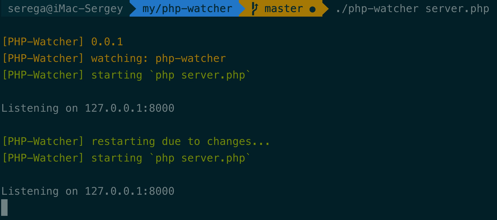

# PHP-watcher

[](https://travis-ci.org/seregazhuk/php-watcher)

PHP-watcher helps develop long-running PHP applications by automatically
 restarting them when file changes in the directory are detected.
 
Here's how it looks like:
 


PHP-watcher does not require any additional changes to your code or method of
 development. `php-watcher` is a replacement wrapper for `php`, to use PHP
 -watcher replace the word `php` in the command line when executing your script.

## Installation

You can install this package globally like this:

```bash
composer global require seregazhuk/php-watcher
```

After that phpunit-watcher watch can be run in any directory on your system.

Alternatively, you can install the package locally as a dev dependency in your
 project:

```bash
composer require seregazhuk/php-watcher --dev
```
Locally installed you can run it with `vendor/bin/php-watcher`.

## Usage

All the examples assume you've installed the package globally. If you opted for the local installation prepend `vendor/bin/` everywhere where `php-watcher` is mentioned.

PHP-watcher wraps your application, so you can pass all the arguments you
 would normally pass to your app:

```bash
php-watcher [your php app]
```

Using PHP-Watcher is simple. If your application accepts a host and port as the
 arguments, I can start it using option `--arguments`:

```bash
php-watcher server.php --arguments localhost --arguments 8080
```

Any output from this script is prefixed with `[php-watcher]`, otherwise all
 output from your application, errors included, will be echoed out as expected.

## Config files

PHP-Watcher supports customization of its behavior with config files. The
 file for options may be named `.php-watcher.yml`, `php-watcher.yml` or `php
 -watcher.yml.dist`. The tool will look for a file in the current working directory in that order. 

The specificity is as follows, so that a command line argument will always override the config file settings:

- command line arguments
- local config

A config file can take any of the command line arguments, for example:

```yml
watch:
  - src
  - config
extensions:
  - php
  - yml
ignore:
  - tests
```

## Monitoring multiple directories

By default, PHP-Watcher monitors the current working directory. If you want to
 take control of that option, use the `--watch` option to add specific paths:

```bash
php-watcher --watch src --watch config server.php
```

Now PHP-Watcher will only restart if there are changes in the `./src` or
 `./config
` directories. By default traverses sub-directories, so there's no
 need to explicitly include them.

## Specifying extension watch list

By default, PHP-Watcher looks for files with the `.php` extension. If you use
 the `--ext` option and monitor `app,yml` PHP-Watcher will monitor files with
  the extension of `.php` and `.yml`:

```bash
php-watcher server.php --ext=php,js
```

Now PHP-Watcher will restart on any changes to files in the directory (or
 subdirectories) with the extensions `.php`, `.yml`.

## Ignoring files

By default, PHP-Watcher will only restart when a `.php` file changes. In
 some cases you may want to ignore some specific files, directories or file
  patterns, to prevent PHP-Watcher from prematurely restarting your application.

This can be done via the command line:

```bash
php-watcher server.php --ignore public/ --ignore tests/
```

Or specific files can be ignored:

```bash
php-watcher server.php --ignore src/config.php
```

Patterns can also be ignored (but be sure to quote the arguments):

```bash
php-watcher server.php --ignore 'src/config/*.php'
```

Note that by default, PHP-Watcher ignores all *dot* and VCS files.

## Delaying restarting

In some situations, you may want to wait until a number of files have changed
. The timeout before checking for new file changes is 1 second. If you're
 uploading a number of files and it's taking some number of seconds, this could cause your app to 
 restart multiple times unnecessarily.

To add an extra throttle, or delay restarting, use the `--delay` option:

```bash
php-watcher server.php --delay 10 
```

For more precision, use a float:

```bash
php-watcher server.php --delay 2.5 
```

## Default executable

By default, PHP-Watcher uses `php` bin executable to run your scripts. If you
 want to provide your own executable use `--exec` option or `executable
 ` param in config file. This is particularly useful if you're working with
  several PHP versions.

```yml
executable: php
```

or using CLI:

```bash
php-watcher server.php --exec php7
```

# License

MIT [http://rem.mit-license.org](http://rem.mit-license.org)

## How can I thank you?

Why not star this GitHub repo? I'd love the attention!
Or, you can donate to my project on PayPal:

[](https://www.paypal.me/seregazhuk)

Thanks! 
