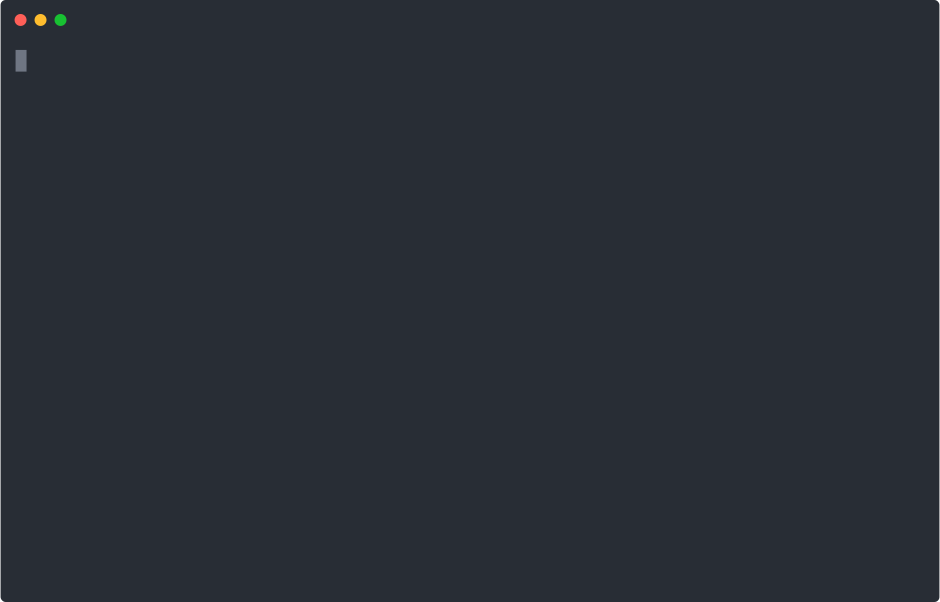

# PHP-watcher

[](https://php.net/)
[](https://travis-ci.org/seregazhuk/php-watcher)
[](https://scrutinizer-ci.com/g/seregazhuk/php-watcher/?branch=master)
[](https://packagist.org/packages/seregazhuk/php-watcher)

[](https://packagist.org/packages/seregazhuk/php-watcher)
[](https://packagist.org/packages/seregazhuk/php-watcher)
[](https://packagist.org/packages/seregazhuk/php-watcher)

[](https://packagist.org/packages/seregazhuk/php-watcher)


PHP-watcher helps develop long-running PHP applications by automatically
 restarting them when file changes in the directory are detected.
 
Here's how it looks like:
 


PHP-watcher does not require any additional changes to your code or method of
 development. `php-watcher` is a replacement wrapper for `php`, to use PHP
 -watcher replace the word `php` in the command line when executing your script.

**Table of contents**

* [Installation](#installation)
* [Usage](#usage)
* [Config files](#config-files)
* [Monitoring multiple directories](#monitoring-multiple-directories)
* [Specifying extension watch list](#specifying-extension-watch-list)
* [Ignoring files](#ignoring-files)
* [Delaying restarting](#delaying-restarting)
* [Default executable](#default-executable)
* [Gracefully reloading down your script](#gracefully-reloading-down-your-script)
* [Automatic restart](#automatic-restart)
* [Spinner](#spinner)

## Installation

You can install this package globally like this:

```bash
composer global require seregazhuk/php-watcher
```

After that phpunit-watcher watch can be run in any directory on your system.

Alternatively, you can install the package locally as a dev dependency in your
 project:

```bash
composer require seregazhuk/php-watcher --dev
```
Locally installed you can run it with `vendor/bin/php-watcher`.

## Usage

All the examples assume you've installed the package globally. If you opted for the local installation prepend `vendor/bin/` everywhere where `php-watcher` is mentioned.

PHP-watcher wraps your application, so you can pass all the arguments you
 would normally pass to your app:

```bash
php-watcher [your php app]
```

Using PHP-Watcher is simple. If your application accepts a host and port as the
 arguments, I can start it using option `--arguments`:

```bash
php-watcher server.php --arguments localhost --arguments 8080
```

Any output from this script is prefixed with `[php-watcher]`, otherwise all
 output from your application, errors included, will be echoed out as expected.

## Config files

PHP-Watcher supports customization of its behavior with config files. The
file for options may be named `.php-watcher.yml`, `php-watcher.yml` or `php-watcher.yml.dist`. 
The tool will look for a file in the current working directory in that order. 
An alternative local configuration file can be specified with the `--config
 <file>` option.

The specificity is as follows, so that a command line argument will always override the config file settings:

- command line arguments
- local config

A config file can take any of the command line arguments, for example:

```yml
watch:
  - src
  - config
extensions:
  - php
  - yml
ignore:
  - tests
```

## Monitoring multiple directories

By default, PHP-Watcher monitors the current working directory. If you want to
 take control of that option, use the `--watch` option to add specific paths:

```bash
php-watcher --watch src --watch config server.php
```

Now PHP-Watcher will only restart if there are changes in the `./src` or
 `./config
` directories. By default traverses sub-directories, so there's no
 need to explicitly include them.

## Specifying extension watch list

By default, PHP-Watcher looks for files with the `.php` extension. If you use
 the `--ext` option and monitor `app,yml` PHP-Watcher will monitor files with
  the extension of `.php` and `.yml`:

```bash
php-watcher server.php --ext=php,yml
```

Now PHP-Watcher will restart on any changes to files in the directory (or
 subdirectories) with the extensions `.php`, `.yml`.

## Ignoring files

By default, PHP-Watcher will only restart when a `.php` file changes. In
 some cases you may want to ignore some specific files, directories or file
  patterns, to prevent PHP-Watcher from prematurely restarting your application.

This can be done via the command line:

```bash
php-watcher server.php --ignore public/ --ignore tests/
```

Or specific files can be ignored:

```bash
php-watcher server.php --ignore src/config.php
```

Patterns can also be ignored (but be sure to quote the arguments):

```bash
php-watcher server.php --ignore 'src/config/*.php'
```

Note that by default, PHP-Watcher ignores all *dot* and VCS files.

## Delaying restarting

In some situations, you may want to wait until a number of files have changed
. The timeout before checking for new file changes is 1 second. If you're
 uploading a number of files and it's taking some number of seconds, this could cause your app to 
 restart multiple times unnecessarily.

To add an extra throttle, or delay restarting, use the `--delay` option:

```bash
php-watcher server.php --delay 10 
```

For more precision, use a float:

```bash
php-watcher server.php --delay 2.5 
```

## Default executable

By default, PHP-Watcher uses `php` bin executable to run your scripts. If you
 want to provide your own executable use `--exec` option or `executable` param in config file. This is particularly useful if you're working with
  several PHP versions.

```yml
executable: php
```

or using CLI:

```bash
php-watcher server.php --exec php7
```

### Running non-php scripts

PHP-Watcher can also be used to execute and monitor other non-php programs. For example, you can use PHP-Watcher to listen to `*.js` files and use `node` executable to run them:

```bash
php-watcher server.js --exec node --watch app --ext=js
```

The command above uses NodeJS to start `server.js` and then listens to changes in `app` directory.

## Gracefully reloading down your script

It is possible to have PHP-watcher send any signal that you specify to your
 application.

```bash
php-watcher --signal SIGTERM server.php
```

Your application can handle the signal as follows:

```php
declare(ticks = 1);

pcntl_signal(SIGTERM, 'terminationHandler');

function terminationHandler()
{
    // ...        
}
```

By default PHP-watcher sends `SIGINT` signal.

## Automatic restart

PHP-watcher was originally written to restart long-running processes such as web servers, but 
it also supports apps that cleanly exit. If your script exits cleanly, the watcher will continue 
to monitor the directory (or directories) and restart the script if there are any changes. If the
script crashes PHP-watcher will notify you about that.


## Spinner

By default the watcher outputs a nice spinner which indicates that the process is running
and watching your files. But if your system doesn't support ansi coded the watcher
will try to detect it and disable the spinner. Or you can always disable the spinner
manually with option '--no-spinner':

```bash
php-watcher server.php --no-spinner
```

# License

MIT [http://rem.mit-license.org](http://rem.mit-license.org)

## How can I thank you?

Why not star this GitHub repo? I'd love the attention!
Or, you can donate to my project on PayPal:

[](https://www.paypal.me/seregazhuk)

Thanks! 
